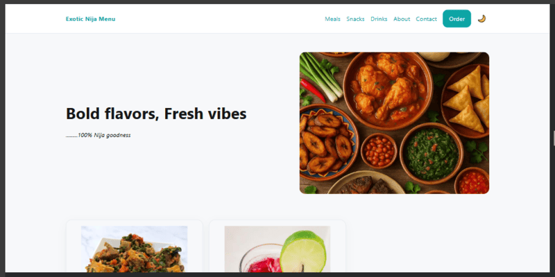
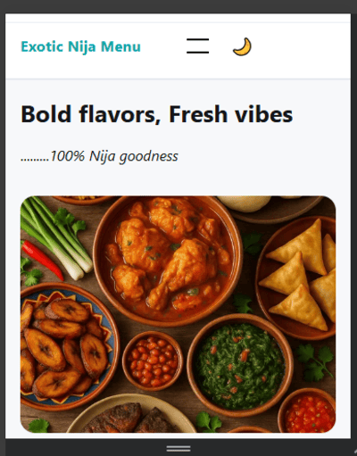

.

🍽️ Exotic Nija Menu

A responsive, lightweight, and visually appealing Nigerian food menu website showcasing a curated selection of traditional classics and creative modern twists. Designed for fast loading, clean structure, and mobile-first performance.

🚀 Live Demo

GitHub Pages: https://meltingwax-19.github.io/exotic-nija-menu/

Repository: https://github.com/meltingwax-19/exotic-nija-menu

✨ Features

Mobile-first responsive design — adapts seamlessly to phones, tablets, and desktops.

Clean semantic HTML — structured for accessibility and SEO.

Custom CSS styling — fully hand-coded for control and learning.

Optimized images — .webp + fallback with semantic naming.

Accessible navigation — logical heading order, descriptive alt attributes.

Local assets — no external dependencies required for core functionality.

🛠️ Tech Stack

HTML5 — semantic markup for structure and accessibility.

CSS3 — custom styles, mobile-first approach, responsive breakpoints.

Flexbox & CSS Grid — layout management for different screen sizes.

Vanilla JavaScript — for interactivity and enhancements.

GitHub Pages — static site hosting.

🗂️ Project Structure
exotic-nija-menu/
├─ about.html
├─ contact.html
├─ drinks.html
├─ index.html
├─ meals.html
├─ snacks.html
├─ recipe.html
├─ recipe-1.html
├─ recipe-2.html
├─ recipe-3.html
├─ recipe-4.html
├─ recipe-5.html
├─ recipe-6.html
├─ recipe-7.html
├─ README.md
├─ assets/
│  ├─ css/
│  │  └─ styles.css
│  ├─ images/
│  │  ├─ african-cuisine.webp
│  │  ├─ efo-riro.webp
│  │  ├─ efo-riro.png  (fallback)
│  │  ├─ jollof-rice.webp
│  │  ├─ kunu-drink.webp
│  │  ├─ nija-buns.webp
│  │  ├─ nija-chin-chin.webp
│  │  ├─ roasted-plantain-with-groundnut.webp
│  │  ├─ vegetable-yam-porridge.webp
│  │  ├─ zobo-or-hibiscus-drink.webp
│  └─ js/
│     └─ script.js

🖼️ Screenshots

🖼️ Special Image Handling — Efo riro Issue

During development, the original Efo riro dish image was:

Too large — slowed down page load.

Unoptimized format — only .jpg was available.

Solution:

Converted .jpg → .webp for main use.

Kept .png fallback for browsers without .webp support.

Resized to ~800px width.

Compressed to ~90 KB (.webp) and ~150 KB (.png fallback).

Added descriptive alt text for accessibility.

HTML Example:

<picture>
  <source srcset="assets/images/efo-riro.webp" type="image/webp">
  
</picture>

📦 Local Setup

No build tools required — just open index.html in your browser.

# Optional local server (Python 3)
python -m http.server 5500
# Visit http://localhost:5500

🌐 Deployment (GitHub Pages)

Commit and push your latest changes:

git add .
git commit -m "chore: initial commit"
git push origin main

In GitHub, go to Settings → Pages.

Set Source = Deploy from a branch.

Choose Branch = main and Folder = / (root).

Save — your site will publish at:
https://meltingwax-19.github.io/exotic-nija-menu/

📏 Image Optimization Rules (General)

Preferred format: .webp first, .png or .jpg fallback.

Hero images: ~1600px width, 150–250 KB.

Dish images: ~800–1200px width, 50–150 KB.

Semantic file names: dish-name.webp (kebab-case).

Alt text: short, descriptive, accessible.

📋 Accessibility & Performance Checklist

 Meaningful <alt> for all images.

 Sufficient color contrast.

 Logical heading hierarchy.

 Images optimized for web.

 Mobile-first breakpoints.

📝 License

This project is licensed under the MIT License — free to use and adapt.

🙏 Credits

Food photography: © respective owners / project author.

Icons: if applicable (e.g., Remix Icons / Heroicons).
